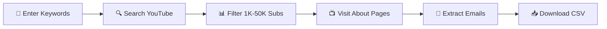

<p align="center">
  
</p>

<h1 align="center">📺 YouTube Lead Generator — Chrome Extension</h1>

<p align="center">
  <strong>Find small YouTube channels. Extract their emails. Export to CSV. All on autopilot.</strong>
</p>

<p align="center">
  
  
  
  
</p>

---

## 😩 The Problem

You want to reach out to small YouTube creators to **collaborate, offer free access to your SaaS, or set up affiliate deals** — but manually finding channels, checking their subscriber count, visiting their About page, and copying emails takes FOREVER.

Doing this for even 50 channels can eat up your entire afternoon.

## 🚀 The Solution

**YouTube Lead Generator** does all of this automatically:

1. **You enter keywords** (or load them from a `.txt` file)
2. **It searches YouTube** and filters channels between **1K–50K subscribers**
3. **It visits each channel's About page** and extracts their email
4. **You download a clean CSV** with Channel Name, URL, Email, and Subscriber Count

That's it. What used to take hours now takes minutes.

---

## 🎬 Demo

<p align="center">
  
</p>

<p align="center">
  
</p>

---

## ✨ Features

| Feature | Description |
|---|---|
| 🔍 **Keyword-Based Search** | Enter one or multiple keywords — the extension searches YouTube for matching channels |
| 📊 **Smart Subscriber Filter** | Only targets channels with **1K–50K subscribers** — the sweet spot for outreach |
| 📧 **Automatic Email Extraction** | Visits each channel's About page and pulls emails from descriptions, links, and mailto tags |
| 📁 **Bulk Keyword Loading** | Load hundreds of keywords from a `.txt` file in one click |
| 📥 **One-Click CSV Export** | Download all leads as a CSV file — ready for your outreach tool or spreadsheet |
| 🔄 **Real-Time Activity Log** | Watch the scraping happen live with a built-in status dashboard |
| ⏱️ **Anti-Detection Delays** | Human-like random delays between actions to avoid getting flagged |
| 🔁 **Deduplication** | Automatically skips channels already scraped across keywords |
| 🎨 **Clean Dark UI** | Beautiful, modern popup interface — no clutter, no confusion |

---

## 📋 How It Works

```
Keywords → YouTube Search → Filter (1K-50K subs) → Visit About Pages → Extract Emails → CSV
```



---

## 📦 What's in the CSV?

| Column | Example |
|---|---|
| Channel Name | `Creative Studio Pro` |
| URL | `https://youtube.com/@creativestudiopro` |
| Email | `hello@creativestudio.com` |
| Subscribers | `12.5K subscribers` |

---

## 🎯 Who Is This For?

- **SaaS founders** — Find micro-influencers to review your product in exchange for free access
- **Tech startups** — Build targeted outreach lists of creators in your exact niche
- **Digital product sellers** — Partner with small channels for affiliate cross-promotions
- **Agency owners** — Build a lead list of potential tech/creator clients
- **Marketers** — Bypass expensive lead databases and scrape high-intent emails directly
- **Bootstrappers** — Automate your cold outreach pipeline without paying $100/mo for a lead scraper

---

## 💰 Get the Extension

<p align="center">
  <a href="https://prompttoebook.gumroad.com/l/mcedbq">
    
  </a>
</p>

<p align="center">
  <strong>⚡ One-time purchase. No subscription. Lifetime updates.</strong>
</p>

👉 **[Get YouTube Lead Generator on Gumroad →](https://prompttoebook.gumroad.com/l/mcedbq)**

---

## 🛠️ Installation (After Purchase)

1. Download the `.zip` file from Gumroad
2. Unzip the folder
3. Open Chrome and go to `chrome://extensions`
4. Enable **Developer Mode** (toggle in top-right)
5. Click **"Load unpacked"** and select the unzipped folder
6. Click the extension icon in your toolbar — you're ready to go! 🚀

---

## 📝 Tips for Best Results

- **Use specific niche keywords** — `"sell canva templates"` works better than `"make money"`
- **Load keywords in bulk** — Prepare a `.txt` file with 50–100 keywords for maximum coverage
- **Let it run in the background** — The extension opens tabs quietly while you do other work
- **Check emails carefully** — Not all channels have public emails; the extension extracts what's available

---

## ❓ FAQ

**Q: Does this work with YouTube's current layout?**
A: Yes — built for the latest YouTube UI as of 2025. Manifest V3 compliant.

**Q: Will I get banned from YouTube?**
A: The extension uses human-like delays between actions to minimize detection. Use responsibly.

**Q: Can I use this for cold outreach?**
A: Absolutely. That's exactly what it's designed for. Just make sure your outreach is valuable and not spammy.

**Q: Is this a subscription?**
A: No. One-time purchase, yours forever.

---

<p align="center">
  <strong>Built for hustlers who hate wasting time on manual lead generation. 🔥</strong>
</p>

<p align="center">
  <a href="https://prompttoebook.gumroad.com/l/mcedbq">
    
  </a>
</p>
